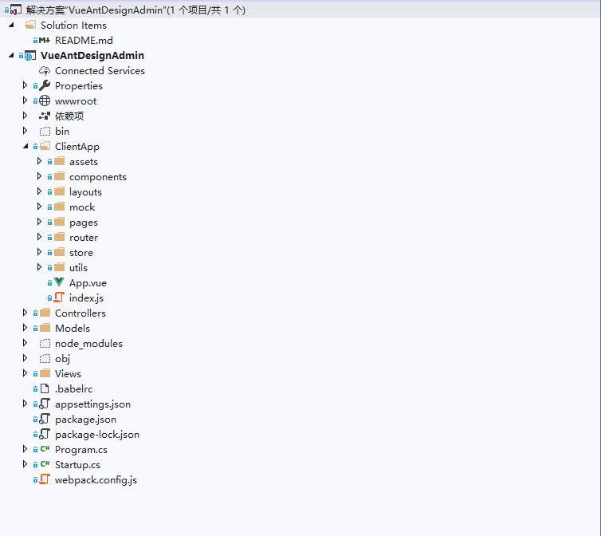
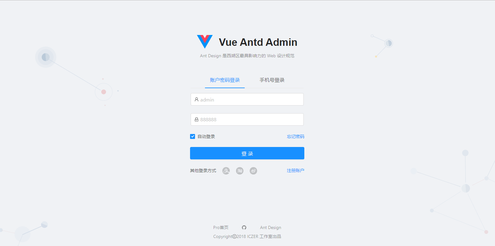
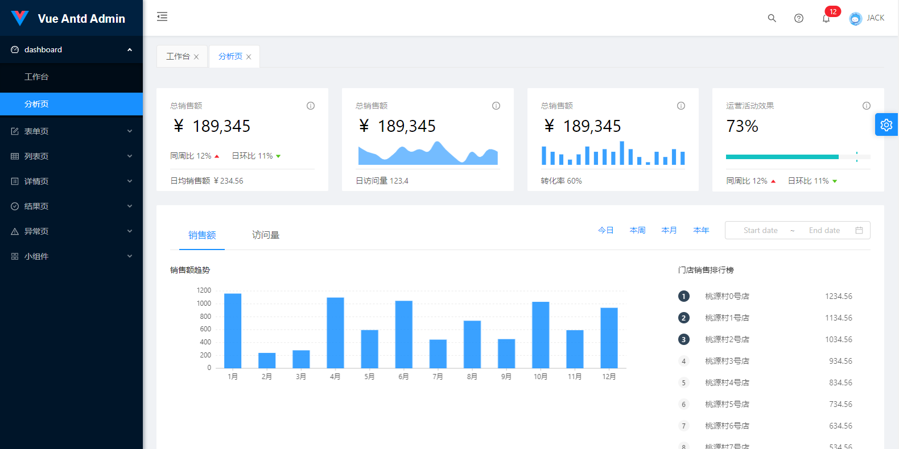
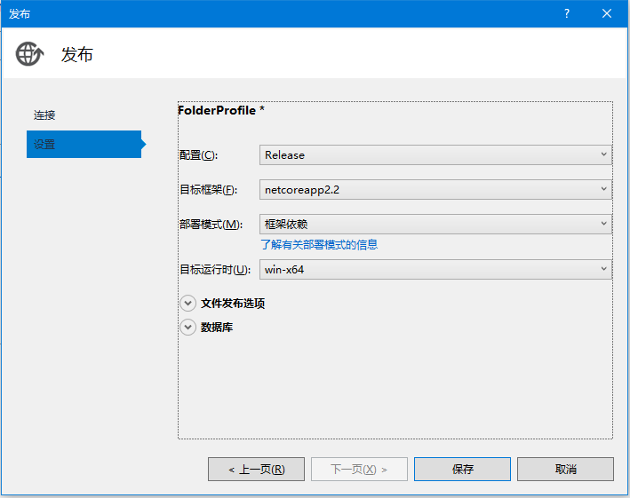
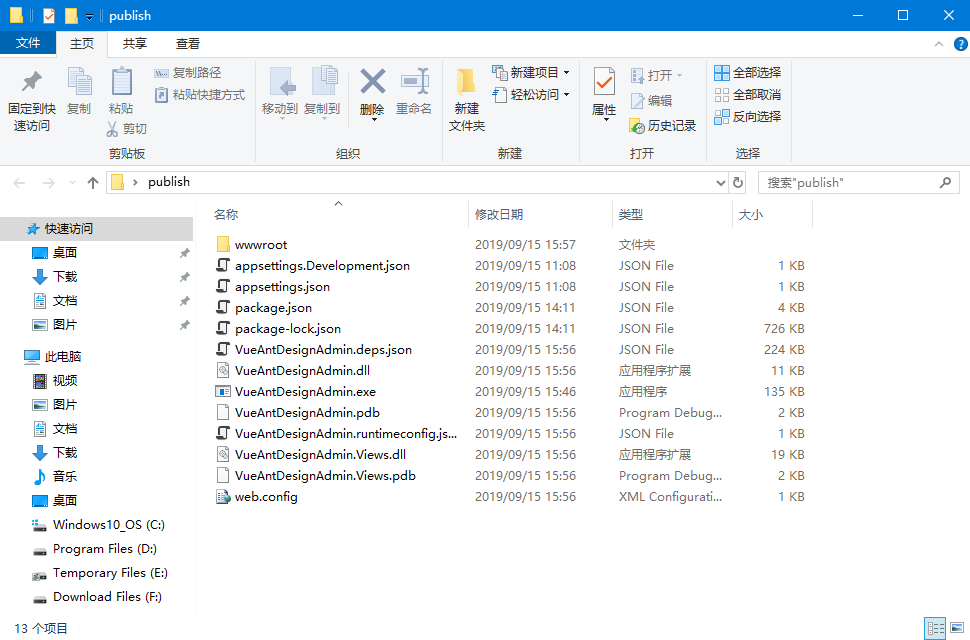
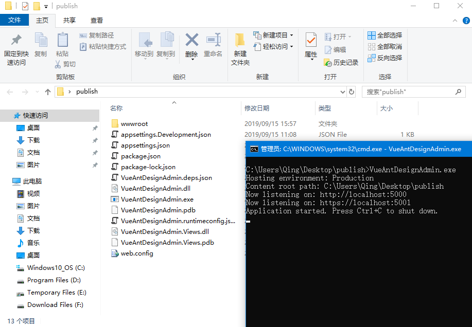
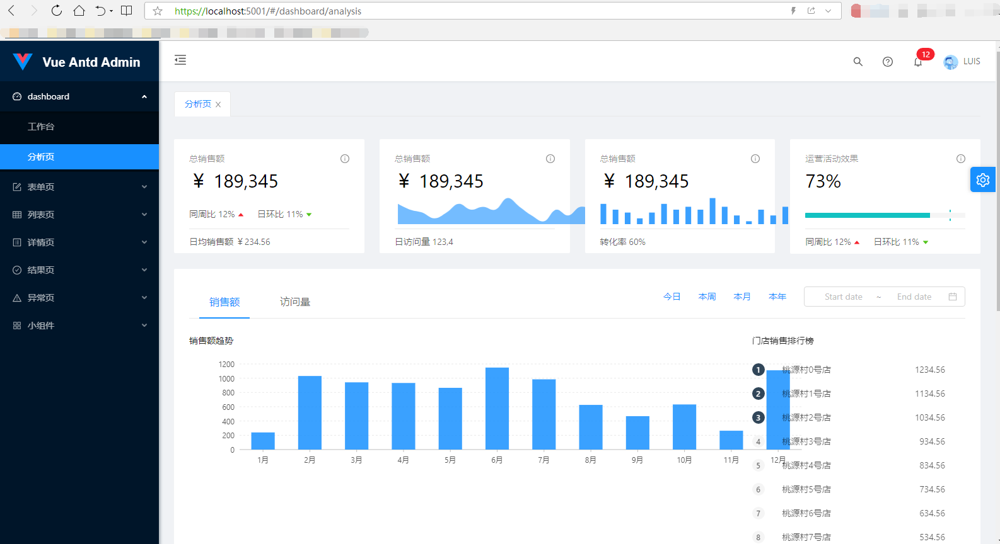

# Vue Ant Design Admin 管理系统
> 基于`Asp.Net Core 2.2` 与 `vue-antd-admin` 整合的快速开发模板

## 代码及效果展示

* 代码结构

* 界面展示

## 运行方式

* 1.发布项目到文件系统（以本机 `Win10 x64` 为例）：

* 2.进入到项目发布路径下：

* 3.右键在命令行中打开，执行 `VueAntDesignAdmin.exe`

* 4.打开浏览器，访问`http://localhost:5000` 或 `https://localhost:5001`

* 5.输入默认用户名和密码：`admin:888888`，登录到系统

